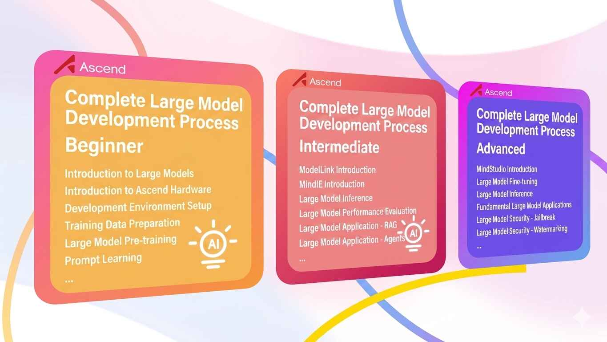
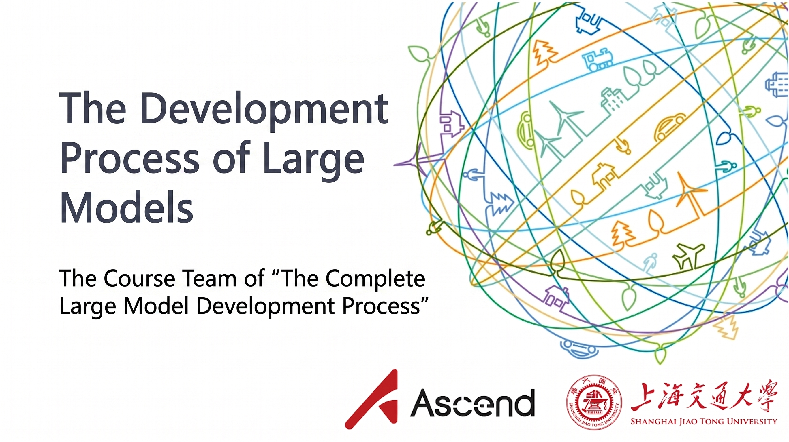
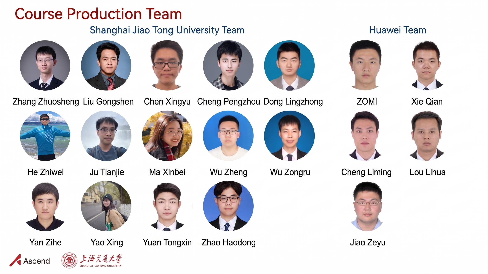
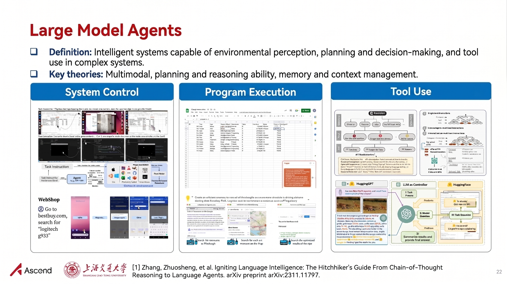

<h1 align="center">Hands-on Large Language Models - Programming Practical Tutorial Series</h1>

   	
  
  
   	
   	
     
     

  <a href="#project-motivation">Motivation</a>/
  <a href="#tutorial-contents">Contents</a>/
  <a href="#contributors">Contributors</a>

## 💡 Updates

2025/06/06  Thank you everyone for your attention and valuable feedback! We have updated this tutorial in the following two aspects:

- [x] Released the domestic "Complete LLM Development Workflow" public welfare tutorial (includes PPT, lab manuals and videos). Special thanks to Huawei Ascend Community for their support!
- [x] Updated content on the original series of practical programming tutorials, and added new topics including mathematical reasoning, GUI Agents, LLM alignment, steganography and more!

## 🎯 Project Motivation

This "Hands-on Large Language Models" practical programming tutorial series is extended from the lecture materials of Shanghai Jiao Tong University courses *Frontiers of Natural Language Processing* (NIS8021) and *Artificial Intelligence Security Technology* (NIS3353) (Instructor: [Zhuosheng Zhang](https://bcmi.sjtu.edu.cn/home/zhangzs/)).

This tutorial is completely free and non-profit. Through simple hands-on exercises, it aims to help students quickly get started with large language models, to better complete course projects or academic research.

## 📚 Tutorial Contents

| Tutorial Topic               | Description | Links |
| ---------------------------- | ----------- | ----- |
| Fine-tuning & Deployment     | Guide for fine-tuning and deploying pre-trained models: Want to improve model performance on specific tasks? Learn to select appropriate pre-trained models, perform task-specific fine-tuning, and deploy the fine-tuned model as an accessible demo! | [[Slides](https://github.com/bhumitschaudhry/dive-into-llms-en/tree/main/documents/chapter1/dive-into-llm.pdf)] [[Tutorial](https://github.com/bhumitschaudhry/dive-into-llms-en/tree/main/documents/chapter1/README.md)] [[Scripts](https://github.com/bhumitschaudhry/dive-into-llms-en/tree/main/documents/chapter1/dive-tuning.ipynb)] |
| Prompt Engineering & Chain-of-Thought | Guide for LLM API calling and reasoning: "LLM needs encouragement? LLMs sometimes give surprising answers, but maybe they just need a little 'encouragement'" | [[Slides](https://github.com/bhumitschaudhry/dive-into-llms-en/tree/main/documents/chapter2/dive-into-prompting.pdf)] [[Tutorial](https://github.com/bhumitschaudhry/dive-into-llms-en/tree/main/documents/chapter2/README.md)] [[Scripts](https://github.com/bhumitschaudhry/dive-into-llms-en/tree/main/documents/chapter2/dive-prompting.ipynb)] |
| Knowledge Editing | Methods and tools for editing language model knowledge: Want to modify what a language model remembers about specific facts? Learn proper editing techniques, modify targeted knowledge, and validate the edited model! | [[Slides](https://github.com/bhumitschaudhry/dive-into-llms-en/blob/main/documents/chapter3/dive_edit_0410.pdf)] [[Tutorial](https://github.com/bhumitschaudhry/dive-into-llms-en/tree/main/documents/chapter3/README.md)]  [[Scripts](https://github.com/bhumitschaudhry/dive-into-llms-en/tree/main/documents/chapter3/dive_edit.ipynb)] |
| Mathematical Reasoning | How to make LLMs learn mathematical reasoning? Let's quickly distill a mini R1 model! | [[Slides](https://github.com/bhumitschaudhry/dive-into-llms-en/blob/main/documents/chapter4/math.pdf)] [[Tutorial](https://github.com/bhumitschaudhry/dive-into-llms-en/tree/main/documents/chapter4/README.md)]  [[Scripts](https://github.com/bhumitschaudhry/dive-into-llms-en/tree/main/documents/chapter4/sft_math.ipynb)] |
| Model Watermarking | Text watermarking for language models: Embed invisible human-undetectable watermarks in LLM generated content | [[Slides](https://github.com/bhumitschaudhry/dive-into-llms-en/blob/main/documents/chapter5/watermark.pdf)] [[Tutorial](https://github.com/bhumitschaudhry/dive-into-llms-en/tree/main/documents/chapter5/README.md)]  [[Scripts](https://github.com/bhumitschaudhry/dive-into-llms-en/tree/main/documents/chapter5/watermark.ipynb)] |
| Jailbreak Attacks | To build better security, you first need to understand attacks. Learn how jailbreak attacks work against LLMs! | [[Slides](https://github.com/bhumitschaudhry/dive-into-llms-en/blob/main/documents/chapter6/dive-Jailbreak.pdf)] [[Tutorial](https://github.com/bhumitschaudhry/dive-into-llms-en/tree/main/documents/chapter6/README.md)] [[Scripts](https://github.com/bhumitschaudhry/dive-into-llms-en/tree/main/documents/chapter6/dive-jailbreak.ipynb)] |
| LLM Steganography | "Invisible ink"! Want LLMs to carry hidden information that only authorized parties can detect while generating natural responses? LLM steganography shows you how! | [[Slides](https://github.com/bhumitschaudhry/dive-into-llms-en/blob/main/documents/chapter7/stega.pdf)] [[Tutorial](https://github.com/bhumitschaudhry/dive-into-llms-en/tree/main/documents/chapter7/README.md)] [[Scripts](https://github.com/bhumitschaudhry/dive-into-llms-en/tree/main/documents/chapter7/llm_stega.ipynb)] |
| Multimodal Models | Multimodal LLMs that better model the real world: How do they achieve powerful multimodal understanding and generation capabilities? Could multimodal LLMs lead us towards AGI? | [[Slides](https://github.com/bhumitschaudhry/dive-into-llms-en/blob/main/documents/chapter8/mllms.pdf)]  [[Tutorial](https://github.com/bhumitschaudhry/dive-into-llms-en/tree/main/documents/chapter8/README.md)] [[Scripts](https://github.com/bhumitschaudhry/dive-into-llms-en/tree/main/documents/chapter8/mllms.ipynb)] |
| GUI Agents | Want hands-free automation? Let AI Agents order food, reply to messages, compare shopping prices for you! | [[Slides](https://github.com/bhumitschaudhry/dive-into-llms-en/blob/main/documents/chapter9/GUIagent.pdf)]  [[Tutorial](https://github.com/bhumitschaudhry/dive-into-llms-en/tree/main/documents/chapter9/README.md)] [[Scripts](https://github.com/bhumitschaudhry/dive-into-llms-en/tree/main/documents/chapter9/GUIagent.ipynb)] |
| Agent Safety | LLM Agents are heading towards future operating systems. But can LLMs recognize risks and threats in open agent environments? | [[Slides](https://github.com/bhumitschaudhry/dive-into-llms-en/blob/main/documents/chapter10/dive-into-safety.pdf)] [[Tutorial](https://github.com/bhumitschaudhry/dive-into-llms-en/tree/main/documents/chapter10/README.md)] [[Scripts](https://github.com/bhumitschaudhry/dive-into-llms-en/tree/main/documents/chapter10/agent.ipynb)] |
| RLHF Alignment | PPO-based RLHF practical guide: This tutorial is "very dangerous" - after reading, please check if your LLM is smirking. | [[Slides](https://github.com/bhumitschaudhry/dive-into-llms-en/blob/main/documents/chapter11/RLHF.pdf)] [[Tutorial](https://github.com/bhumitschaudhry/dive-into-llms-en/tree/main/documents/chapter11/README.md)] [[Scripts](https://github.com/bhumitschaudhry/dive-into-llms-en/tree/main/documents/chapter11/RLHF.ipynb)] |

## 🔥 New Release: Complete LLM Development Workflow (Domestic)

- **✨ Official release of the public welfare "Complete LLM Development Workflow" tutorial created in collaboration with Huawei Ascend! Cutting-edge technology + hands-on coding practice, step-by-step guide to mastering AI large models ✨**:

  Building on the original "Hands-on Large Language Models" series, we have partnered with Huawei to develop this complete LLM development workflow course series. This series is developed based on Ascend hardware and software infrastructure, and includes course materials in the form of PPT slides, lab manuals, and video tutorials.

  The tutorial is divided into beginner, intermediate and advanced levels, tailored for different practical LLM development requirements. It aims to provide researchers and developers with an end-to-end guide for getting started quickly, applying Ascend-supported models, and performing model migration and tuning, through hands-on coding practice of cutting-edge techniques.

- **🚀 Explore the complete "LLM Development Workflow" course series on Ascend Community**:

  👉 [LLM Development Learning Area](https://www.hiascend.com/edu/growth/lm-development#classification-floor-1) @ Ascend Community 👈

- **✨ Course Materials Preview ✨**

  <!-- 
  
  
   -->

  
  
  
  

## 🙏 Disclaimer

All content in this tutorial is based solely on contributors' personal experience, public internet resources, and accumulated knowledge from academic research. All techniques are provided for reference only, and no guarantee of absolute correctness is made. If you encounter any issues, feel free to submit an Issue or PR. Badges used in this project are from public internet sources - if any copyright infringement occurs, please contact us for removal. Thank you.

## 🤝 Contributions Welcome

This tutorial is an ongoing project. Omissions and imperfections are inevitable. All contributions via PR and discussions through issues are warmly welcomed.

## ❤️ Contributors

Thanks to the following teachers and students for their support and contributions to this project:

**"Hands-on Large Language Models" Tutorial Development Team**:

- Shanghai Jiao Tong University: [Zhuosheng Zhang](https://bcmi.sjtu.edu.cn/home/zhangzs/), [Tongxin Yuan](https://github.com/Lordog), [Xinbei Ma](https://scholar.google.com/citations?user=LpUi3EgAAAAJ&hl=zh-CN&oi=ao), [Zhiwei He](https://zwhe99.github.io), [Wei Du](https://scholar.google.com/citations?user=tFYUBLkAAAAJ&hl=en), [Haodong Zhao](https://dongdongzhaoup.github.io/), [Zongru Wu](https://zrw00.github.io/), [Zheng Wu](https://wuzheng02.github.io/), [Lingzhong Dong](https://github.com/LZ-Dong), [Yulong Zhang](https://aslan-yulong.github.io/)

- National University of Singapore: [Hao Fei](http://haofei.vip/)

**"Complete LLM Development Workflow" Tutorial Development Team**:

- Shanghai Jiao Tong University: [Zhuosheng Zhang](https://bcmi.sjtu.edu.cn/home/zhangzs/), [Gongshen Liu](https://infosec.sjtu.edu.cn/DirectoryDetail.aspx?id=75), [Xingyu Chen](https://scholar.google.com/citations?user=d-dNtjrMJ5YC&hl=en), [Pengzhou Cheng](https://scholar.google.com/citations?user=qxnwzDUAAAAJ&hl=en), [Lingzhong Dong](https://github.com/LZ-Dong), [Zhiwei He](https://zwhe99.github.io), [Tianjie Ju](https://scholar.google.com/citations?user=f8PPcnoAAAAJ&hl=en), [Xinbei Ma](https://scholar.google.com/citations?user=LpUi3EgAAAAJ&hl=zh-CN&oi=ao), [Zheng Wu](https://scholar.google.com/citations?hl=zh-CN&user=qBM1UbUAAAAJ&view_op=list_works&gmla=AIfU4H6PG9JyjRub6BYIIZ4isQE7MBAM3Eoec6OJfX4z_8-pOE8bI1Wgdo3XL5qOZWR3U-h-lIP2q0zXt5gzyFKMSg7MNnBBWLv5d1IVG30UANczTP0), [Zongru Wu](https://zrw00.github.io/), [Zihe Yan](https://scholar.google.com/citations?user=O2YfSHoAAAAJ&hl=zh-CN), [Yao Yao](https://scholar.google.com/citations?user=tLMP3IkAAAAJ), [Tongxin Yuan](https://github.com/Lordog), [Haodong Zhao](https://dongdongzhaoup.github.io/);

- Huawei Ascend Community: ZOMI, Qian Xie, Liming Cheng, Lihua Lou, Zeyu Jiao

## 🌟 Star History

